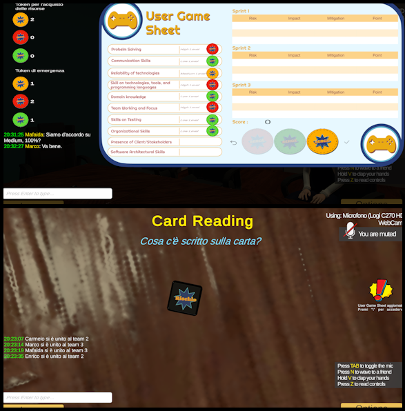

SERGE 2.0&IA: Integrazione di un modello IA in SERGE 2.0
<h3 align = "center"> </h3> 
 Un progetto open-source sviluppato con Unity3D e Photon Unity Networking, basato sul serious game SERGE, con l’obiettivo di creare un ambiente virtuale tridimensionale per scopi accademici ed educativi. Questa versione, SERGE 2.0, integra un modello di intelligenza artificiale capace di generare automaticamente scenari di progetto, permettendo agli utenti di vivere esperienze dinamiche e personalizzate, arricchendo l’apprendimento collaborativo e l’interazione all’interno del gioco.
 
 Questo progetto si basa sul Serious Game SERGE descritto nell’articolo (https://dl.acm.org/doi/abs/10.1145/3639474.3640085).
 
 <!--  --> 

Descrizione dell’Applicazione

L’obiettivo principale di questo progetto è stato sviluppare e validare una ricreazione digitale del serious game SERGE, un gioco educativo progettato per supportare studenti e accademici nell’apprendimento della gestione del rischio. La piattaforma consiste in una sala conferenze tridimensionale dove è possibile interagire con altri giocatori, manipolare oggetti e partecipare alle dinamiche del gioco. Il progetto si basa su precedenti lavori: The Metaverse Classroom di Viviana Pentangelo (vipenti) dell’Università di Salerno e la digitalizzazione del gioco realizzata da Nicola Modugno. SERGE 2.0 integra un modello di intelligenza artificiale capace di generare automaticamente scenari di progetto, offrendo esperienze di gioco dinamiche, personalizzate e maggiormente immersive.

        

Contenuto del Repository

Questo repository contiene il codice completo del progetto Unity per SERGE 2.0, inclusivo delle funzionalità di gioco e dell’integrazione con il modello di intelligenza artificiale per la generazione di scenari di progetto.

Releases incluse:

Windows Build: l’applicazione compilata pronta per l’uso su Windows.

MacOS Build.app: l’applicazione compilata per MacOS.

PJDSceanrios: il modello di intelligenza artificiale che genera scenari di progetto per SERGE 2.0.

Il repository permette quindi sia di esplorare e modificare il progetto Unity completo, sia di utilizzare direttamente le versioni compilate dell’applicazione e il modello AI per sperimentare scenari personalizzati. 

Come Installare Solo Applicazione

Windows:

1. Scaricare l’applicazione

Scarica la cartella Windows Build dalla sezione Releases.

Estrarre (unzip) la cartella in una posizione a tua scelta.

2. Avvio del gioco

Apri la cartella Windows Build all’interno della cartella estratta.

Fare doppio clic su SERGE.exe per avviare il gioco.

3. Avvio del server (solo se sei l’host)

Se vuoi creare una stanza e ospitare altri giocatori, è necessario avviare il server locale.

a. Installazione Python, librerie e ambiente virtuale

All’interno della cartella Server_python in Windows Build, fare doppio clic su avviamento_python_server.bat.

Questo installerà Python (se non presente), tutte le librerie necessarie e configurerà l’ambiente virtuale per far girare il server.

b. Avvio server

Dopo aver eseguito correttamente avviamento_python_server.bat, fare doppio clic su avvia_server.bat sempre nella cartella Server_python per avviare il server.

MacOS:

1. Scaricare l’applicazione

Scarica la cartella MacOS Build.app dalla sezione Releases.

Estrarre (unzip) la cartella in una posizione a tua scelta.

2. Avvio del gioco

Apri la cartella MacOS Build.app all’interno della cartella estratta.

Dal terminale, esegui i seguenti comandi (sostituendo ~/tuo_percorso/MacOS Build.app con il percorso corretto del file sul tuo Mac):

chmod +x ~/tuo_percorso/MacOS Build.app/Contents/MacOS/SERGE

~/tuo_percorso/MacOS Build.app/Contents/MacOS/SERGE

3. Installazione Python, librerie e ambiente virtuale (solo per host)

Se sei l’host (creatore della stanza), devi configurare il server locale. Dal terminale:

chmod +x ~/tuo_percorso/MacOS Build.app/Contents/MacOS/installazione_python_server.sh

sed -i '' 's/\r$//' ~/tuo_percorso/MacOS Build.app/Contents/MacOS/installazione_python_server.sh

~/tuo_percorso/MacOS Build.app.app/Contents/MacOS/installazione_python_server.sh

Questo installerà Python (se non presente), tutte le librerie necessarie e configurerà l’ambiente virtuale per il server.

4. Avvio server (solo host)

Dopo aver eseguito correttamente lo script di installazione, avvia il server con:

chmod +x ~/tuo_percorso/MacOS Build.app/Contents/MacOS/avvia_server.sh

sed -i '' 's/\r$//' ~/tuo_percorso/MacOS Build.app/Contents/MacOS/avvia_server.sh

~/tuo_percorso/MacOS Build.app/Contents/MacOS/avvia_server.shProgetto Unity

Requisiti:

Versione Unity3D: 2021.3.22f1

Unity Hub

Passaggi:

1. Scaricare il progetto

Scarica la cartella SERGE dal repository.

2. Scaricare il modello AI

Scarica il modello PJDScenarios dalla release PJDScenarios.

3. Inserire il modello

All’interno della cartella Server_python in SERGE, crea una nuova cartella chiamata Model.

Inserisci il modello scaricato in una sottocartella chiamata PJDScenarios dentro la cartella Model.

La cartella PJDScenarios deve contenere i seguenti file:

config.json
generation_config.json
merges.txt
model.safetensors
special_tokens_map.json
tokenizer.json
tokenizer_config.json
vocab.json

4. Aprire il progetto in Unity Hub

Apri Unity Hub, vai nella scheda Projects e clicca su Open.

Seleziona il percorso della cartella SERGE.

Il progetto comparirà nella lista dei progetti. Clicca sul suo nome: Unity installerà automaticamente tutte le librerie necessarie.

5. Avviare il server

Segui le istruzioni specifiche per il tuo sistema operativo (Windows o MacOS) riportate nelle sezioni precedenti per avviare il server locale.

Ringraziamenti

Raffaele Del Sorbo, Niccolò Pio Tancredi e Vincenzo Sangiovanni per aver contribuito nella fase di testing delle applicazioni.

Tutti i membri delle comunità open-source di Unity3D, Photon Unity Networking e delle librerie Python per l’IA, il cui lavoro ha reso possibile questo progetto.
