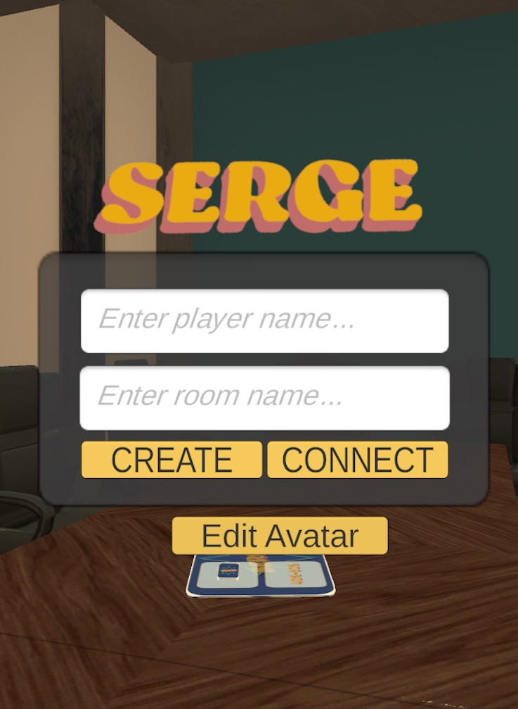

<h1 align="left">SERGE 2.0 & IA: Integrazione di un modello IA in SERGE 2.0</h1>

<h3 align="left"></h3>
<p align="left">
Un progetto open-source sviluppato con Unity3D e Photon Unity Networking, basato sul serious game SERGE, con l’obiettivo di creare un ambiente virtuale tridimensionale per scopi accademici ed educativi.  
Questa versione, **SERGE 2.0**, integra un modello di intelligenza artificiale capace di generare automaticamente scenari di progetto, permettendo agli utenti di vivere esperienze dinamiche e personalizzate, arricchendo l’apprendimento collaborativo e l’interazione all’interno del gioco.
</p>

<p align="left">
Questo progetto si basa sul Serious Game SERGE descritto nell’articolo: [ACM Link](https://dl.acm.org/doi/abs/10.1145/3639474.3640085)
</p>

<!-- <p align="center"></p> -->

---

## Descrizione dell’Applicazione
L’obiettivo principale di questo progetto è stato sviluppare e validare una ricreazione digitale del serious game **SERGE**, un gioco educativo progettato per supportare studenti e accademici nell’apprendimento della gestione del rischio.  
La piattaforma consiste in una **sala conferenze tridimensionale** dove è possibile interagire con altri giocatori, manipolare oggetti e partecipare alle dinamiche del gioco.  

Il progetto si basa su precedenti lavori:  
- *The Metaverse Classroom* di Viviana Pentangelo (vipenti) - Università di Salerno  
- La digitalizzazione del gioco realizzata da Nicola Modugno  

**SERGE 2.0** integra un modello di intelligenza artificiale che genera automaticamente scenari di progetto, offrendo esperienze di gioco dinamiche, personalizzate e maggiormente immersive.

<div align="center">
  
  
  
  <br>
  
  
  
</div>

---

## Contenuto del Repository
Questo repository contiene il codice completo del progetto Unity per **SERGE 2.0**, comprensivo delle funzionalità di gioco e dell’integrazione con il modello di intelligenza artificiale per la generazione di scenari di progetto.

**Releases incluse:**
- **Windows Build**: Applicazione pronta all’uso per Windows  
- **MacOS Build.app**: Applicazione pronta all’uso per MacOS  
- **PJDScenarios**: Modello IA per generazione scenari di progetto  

Il repository permette sia di esplorare e modificare il progetto Unity completo, sia di utilizzare direttamente le versioni compilate dell’applicazione e il modello IA per sperimentare scenari personalizzati.

---

## Come Installare

### Solo Applicazione

#### Windows
1. **Scaricare l’applicazione**  
   Scarica la cartella **APP_Windows.zip** dalla sezione Releases e estraila in una posizione a tua scelta.  

2. **Avvio del gioco**  
   Apri la cartella **APP_Windows** e fai doppio clic su `SERGE.exe`.

3. **Avvio del server locale (solo host)**  
   a. Installazione Python, librerie e ambiente virtuale:  
   - All’interno della cartella `Server_python`, esegui `avviamento_python_server.bat`.  
     Questo installerà Python (se necessario) e tutte le librerie richieste.  

   b. Avvio server:  
   - Esegui `avvia_server.bat` nella stessa cartella per avviare il server locale.

---

#### MacOS
1. **Scaricare l’applicazione**  
   Scarica la cartella **MacOS.app.zip** dalla sezione Releases ed estraila in una posizione a tua scelta.  

2. **Avvio del gioco**  
   Apri il terminale ed esegui:  
   ```bash
   chmod +x ~/tuo_percorso/MacOS.app/APP_MAC.app/Contents/MacOS/SERGE
   ~/tuo_percorso/MacOS.app/APP_MAC.app/Contents/MacOS/SERGE

3. **Installazione Python e librerie (solo host)**  
   Apri il terminale ed esegui:  
   ```bash
   chmod +x ~/tuo_percorso/MacOS.app/APP_MAC.app/Contents/MacOS/installazione_python_server.sh
   sed -i '' 's/\r$//' ~/tuo_percorso/MacOS.app/APP_MAC.app/Contents/MacOS/installazione_python_server.sh
   ~/tuo_percorso/MacOS.app/APP_MAC.app/Contents/MacOS/installazione_python_server.sh

4. **Avvio server (solo host)**
   <br>Apri il terminale ed esegui:
   ```bash
   chmod +x ~/tuo_percorso/MacOS.app/APP_MAC.app/Contents/MacOS/avvia_server.sh
   sed -i '' 's/\r$//' ~/tuo_percorso/MacOS.app/APP_MAC.app/Contents/MacOS/avvia_server.sh
   ~/tuo_percorso/MacOS.app/APP_MAC.app/Contents/MacOS/avvia_server.sh

#### Progetto Unity
**Requisiti**
   1. Unity3D versione: 2021.3.22f1
   2. Unity Hub

**Passaggi**
   1. Scaricare la cartella SERGE dal repository.

   2. Scaricare il modello PJDScenarios dalla release corrispondente.

   3. Inserire il modello:
      <br>3.1 All’interno della cartella Server_python in SERGE, creare una cartella Model.
      <br>3.2 Inserire PJDScenarios come sottocartella di Model (Model/PJDScenarios/file elencati sotto) contenente tutti i file richiesti:
              config.json, generation_config.json, merges.txt, model.safetensors, special_tokens_map.json, tokenizer.json, tokenizer_config.json, vocab.json

   4. Aprire il progetto in Unity Hub
      <br>4.1 Vai su Projects → Open e seleziona la cartella SERGE.
      <br>4.2 Unity installerà automaticamente tutte le librerie necessarie.

   5. Avviare il server seguendo le istruzioni specifiche per Windows o MacOS (vedi sopra).

### Ringraziamenti
   - **Raffaele Del Sorbo**, **Niccolò Pio Tancredi** e **Vincenzo Sangiovanni** per il testing delle applicazioni.
   - Tutti i membri delle comunità open-source di **Unity3D**, **Photon Unity Networking** e delle **librerie Python per IA**, il cui lavoro ha reso possibile          questo progetto.
